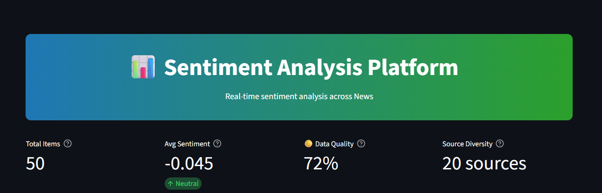
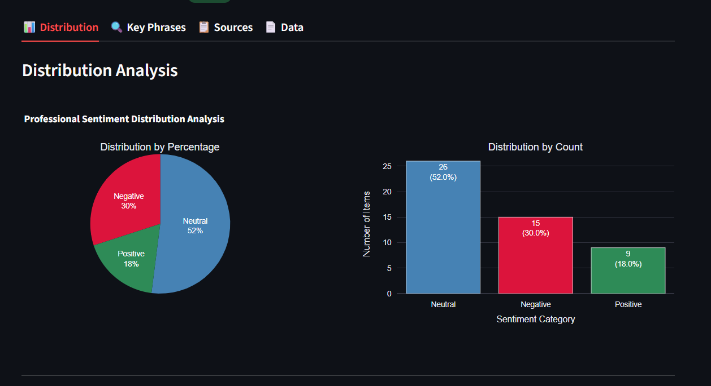
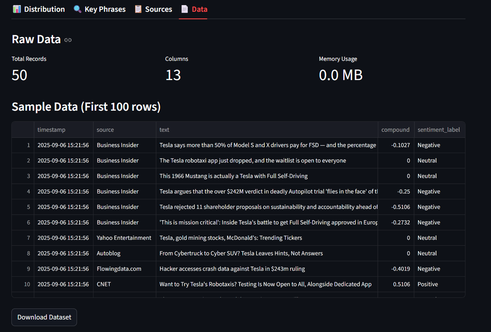
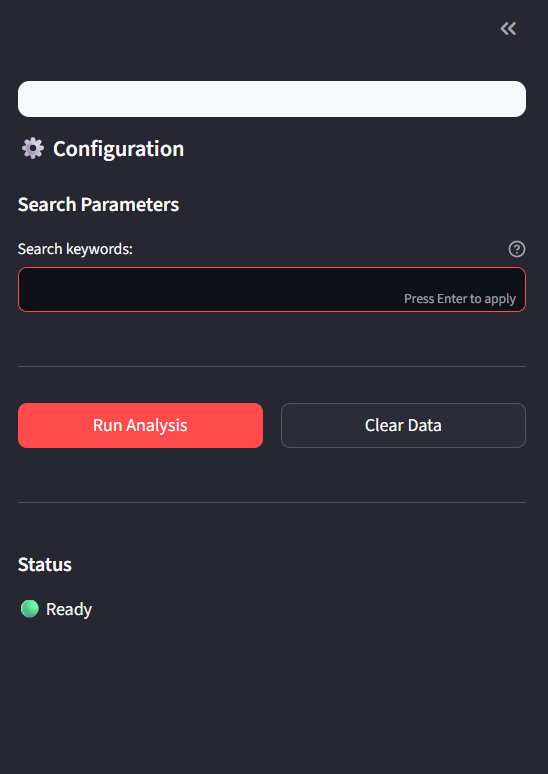

# Professional Sentiment Analyzer

A production-grade sentiment analysis platform for real-time analysis of news content with comprehensive data visualization and insights.

## 📊 Project Overview

This sentiment analysis application provides real-time analysis of news articles with advanced natural language processing capabilities. The platform features **smart demo mode** and **persistent API key storage** for seamless user experience, combining multiple data sources with sophisticated sentiment analysis models to deliver actionable insights through an intuitive web interface.

### 🎯 Key Features

- **Smart Demo Mode**: Works immediately without API keys using realistic sample data
- **Persistent API Key Storage**: One-time API key configuration with automatic saving
- **Real-time News Analysis**: Fetches and analyzes current news articles (when API key provided)
- **Advanced Sentiment Detection**: Uses VADER sentiment analysis for accurate emotional tone detection
- **Named Entity Recognition**: Identifies and extracts key entities from news content
- **Phrase Analysis**: Contextual phrase extraction with sentiment correlation
- **Interactive Visualizations**: Professional charts and metrics with Plotly
- **Multi-metric Dashboard**: Comprehensive data quality and sentiment metrics

## 📸 Screenshots

### Main Dashboard

*The clean, intuitive interface with sidebar controls and demo mode indicator*

### Sentiment Distribution Results

*Interactive sentiment distribution charts with comprehensive metrics*

### data sources

*Advanced phrase extraction with sentiment correlation table (improved black text)*

### Sidebar Configuration

*API key management and analysis parameters*

## 🎭 Demo Mode vs Live Mode

### Demo Mode (Default)
- **No API key required** - Works immediately upon deployment
- **Realistic sample data** - Generates contextual articles for any query
- **Full functionality showcase** - All features work with simulated data
- **Perfect for demonstrations** - Ideal for portfolio showcasing and testing

### Live Mode (When API Key Provided)
- **Real-time data** - Fetches current news articles from NewsAPI
- **Persistent storage** - API key saved securely for future sessions
- **One-time setup** - Enter API key once, works forever for that browser
- **Automatic switching** - Seamlessly switches between demo and live mode

## 🗞️ Data Source Selection

### Primary: NewsAPI (Live Mode) | Sample Data (Demo Mode)

**Live Data Source**: [NewsAPI](https://newsapi.org/)

**Demo Data**: Intelligently generated sample articles that simulate real news

**Why This Hybrid Approach**:

1. **Immediate Usability**: Anyone can try the app without registration
2. **Professional Demonstration**: Shows full capabilities without API limitations
3. **Real-world Application**: Provides actual news analysis when desired
4. **No Barriers**: Public deployment works for everyone
5. **Portfolio Ready**: Perfect for showcasing in interviews or presentations

**NewsAPI Benefits** (When Used):
- 80,000+ news sources worldwide
- Real-time updates every few minutes
- Reliable API with consistent data structure
- Rich metadata and global coverage

## 🤖 Sentiment Analysis Model

### VADER (Valence Aware Dictionary and sEntiment Reasoner)

**Why VADER was Selected**:

1. **News Content Optimized**: Specifically designed for news and social media text
2. **No Training Required**: Pre-built lexicon approach
3. **Real-time Performance**: Extremely fast analysis (2-3 seconds for 50+ articles)
4. **Punctuation & Context Sensitive**: Understands emphasis and negations
5. **Intensity Scoring**: Provides compound scores from -1 to +1

**Technical Advantages**:
- Handles informal language and news headlines effectively
- Provides granular sentiment breakdown (positive, negative, neutral, compound)
- Works consistently in both demo and live modes

## 🚀 Quick Start Guide

### Option 1: Immediate Demo (No Setup Required)
1. **Visit the deployed app** (if available) or run locally
2. **Enter any search query** (e.g., "artificial intelligence", "climate change")
3. **Click "🚀 Run Analysis"** - Works immediately in demo mode
4. **Explore results** across all tabs with realistic sample data

### Option 2: Live Data Setup (One-Time Configuration)
1. **Get your free NewsAPI key**: Visit [newsapi.org](https://newsapi.org/register)
2. **Open the sidebar** and expand "🔑 API Key Configuration"
3. **Enter your API key** in the secure input field
4. **Click "💾 Save API Key"** - Stored permanently for this browser
5. **Run analysis** - Now uses real-time news data

## 🔧 Local Installation

### Prerequisites
- **Python 3.8+** (recommended: Python 3.9 or higher)
- **Internet connection** for data fetching

### Installation Steps

1. **Clone Repository**
   ```bash
   git clone https://github.com/sandipan1nayek/sentiment_analyzer.git
   cd sentiment_analyzer
